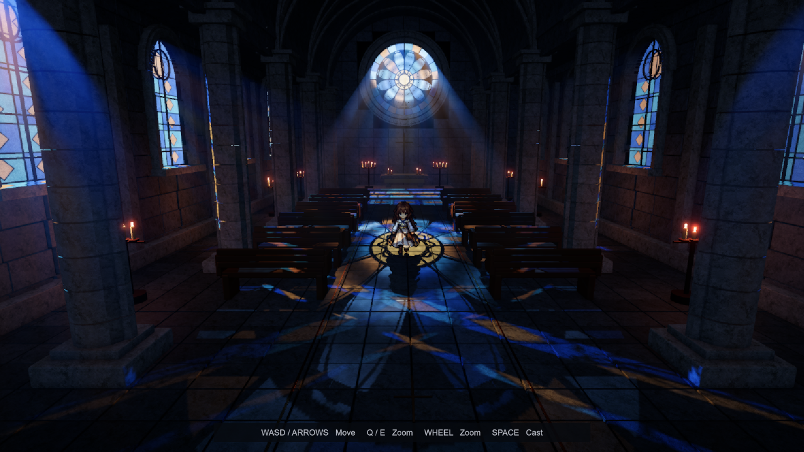

# MVP04 夜色教堂美术方案标准

版本 1.4 · 2026 年 10 月 4 日 · 适用于场景美术、角色美术、灯光、特效和技术美术。

本标准固定 MVP04 的制作方向：**有真实空间和材质层次的暗色教堂，搭配参与场景光照的像素人物、彩窗体积光、暖色摇曳烛光，以及巴洛克星空魔法。** 后续新增资产和场景变体应保持这些关系，并按本文验收。

1.3 新增 [MVP03 潮湿地面与接触涟漪 TA 标准](#wet-ground-ta)，固化同一 HD2D 方案中的积水扩展。该功能当前安装于 MVP03；迁移其他场景时按此章节验收。

## 基准与使用方式

- **必须遵守**：空间投射关系、人物受光方式、像素资产规则、施法朝向、性能验证和资源交付规则。
- **当前基准**：从代码、材质、预制体及 Unity 当前工作区读取的数值，记录在 [ArtBaseline.json](ArtBaseline.json)。恢复 MVP04 观感时优先使用这些数值。
- **建议范围或交付目标**：本文为后续制作提出的控制范围，不代表已经实测覆盖所有范围。

教堂首版基于代码提交 `36ea4be`，其外部光源、空气材质和渲染质量的本地调校记录在原快照中。1.3 的积水实现基于 `f09aca4`，参数快照直接记录在新增章节，来源为 2026 年 10 月 4 日的 `WetPuddle.mat` 与 Shader 默认值。各版本快照用于对照，不自动应用，也不把生成器默认值当成当前观感。截图中的雾丝、烛火和人物位置随时间变化。

入口场景为 [MVP04_NocturneChapel.unity](Scenes/MVP04_NocturneChapel.unity)。[README](README.md)说明操作和工具菜单；本文说明应当做成什么样、哪些实现关系必须保留。

## 视觉定位与画面层级

### 整体气质

关键词为庄严、幽暗、古老、微妙的不安。诡谲感来自过高的建筑尺度、远端圆窗、空气中的流动和冷暖光源之间的距离。人物和通路必须清楚，暗部应保留柱身、地板接缝、长椅的轮廓。

建筑使用可辨识的石材、木材和金属，表面具备细节和连续光照。人物使用清晰的像素轮廓和成组色块。全画面的轻微像素处理把两者连接起来，保持石材起伏、窗棂和星点仍然可读。

### 色彩职责

下表为美术配色职责。示意色是显示用 sRGB 色，不可直接代替材质中的 HDR 数值或光源参数。

| 部分 | 色彩与明暗 | 画面职责 |
| --- | --- | --- |
| 主体建筑 | 深蓝灰、石板灰，示意 `#202B3C`、`#465267` | 构成最大面积的中暗背景 |
| 彩窗与窗光 | 冰蓝、灰白，少量淡金 | 标记空间方向，形成地面投影和空气光束 |
| 烛火与近处反光 | 琥珀橙、旧金，示意 `#E6A45F` | 提供局部温度和节奏，照亮邻近材质 |
| 人物 | 栗棕发色、象牙白衣裙、深蓝布料、少量金边 | 用清楚的剪影与明暗块面建立可玩主体 |
| 魔法 | 暖金纹样、白蓝光球、蓝紫尾迹 | 蓄力与发射分成两个可辨识阶段 |

观察顺序应当是人物与施法反馈、行走方向和远端圆窗、侧面彩窗、建筑细部。允许光球核心和烛芯出现很小的高亮；圆窗花纹、柱廊和半个屏幕都被压成白色时不通过验收。

### 参考画面

下图用于确认构图、冷暖关系、建筑与人物的结合方式。精确光照值以参数快照为准。

角色样式以 [四方向图集](Textures/PilgrimWalk.png)和 [人物近景](../../Previews/MVP04_Walk_Front.png)为准。魔法纹样见 [纹样外观](../../Previews/MVP04_BaroqueDetail.png)，拖尾见 [光球外观](../../Previews/MVP04_AstralFlight.png)。这两张魔法截图早于朝向和加速修正，动态行为以本文魔法章节为准。

## 场景与镜头

### 空间构成

当前地基约宽 18 m、长 32 m。长轴通向祭坛和正面圆形玫瑰窗；两侧分别有四扇高窗、连续柱廊、六排成对长椅。拱肋、窗框、地面铺装和中央金属嵌线共同强化纵深。

| 构件 | 当前基准 | 制作要求 |
| --- | --- | --- |
| 正面圆窗 | 中心约 `(0, 8.4, 17.45)`，玻璃半径 2.63 m | 圆形主体及石雕同心环保持清楚；窗洞具有实际几何开口 |
| 侧窗 | 墙面约 `x = ±8.86`；宽 2.44 m，底部高 3 m，顶部高 7.5 m | 窗框、拱顶、窗棂和玻璃轮廓相互匹配 |
| 侧窗节奏 | 沿 z 轴为 `-6、0、6、12` m | 立柱占据窗间实体墙，避免封住窗洞 |
| 地面 | 大块板石、细缝、少量黄铜嵌线 | 主通路与家具保持形体和受光差异 |
| 倒角 | 现有常见构件约 0.018–0.045 m | 足以接住高光；远景用轮廓判断，避免满屏细碎亮边 |

墙体、窗洞和房间包围范围必须同步维护。投影算法当前使用固定教堂包围范围与窗口位置；修改建筑尺寸时，同时更新 `ChapelWindowLight` 中的边界、窗洞映射及对应 Shader 数据，不能只移动玻璃网格。

装饰集中在窗框、拱肋、祭坛和金属收边。新增损坏、裂纹或污渍应顺着构件关系布置，中央通路保持清楚。碰撞使用简单盒体或已有组合碰撞体，装饰性细缝不单独参与角色碰撞。

### 镜头与尺度

| 项目 | 固定基准 |
| --- | --- |
| 投影 | 透视相机，FOV 56°，当前俯角约 11.4° |
| 跟随 | 人物居中，观察目标约为人物根节点上方 1 m |
| 缩放 | 距离 5–15 m；Q/E 与滚轮；只平滑缩放距离 |
| 裁剪 | Near 0.12 m，Far 80 m |
| 行走 | 3.4 m/s，前后左右四方向，最近按下的轴优先 |
| 身体碰撞 | 高 1.7 m、半径 0.28 m，中心高 0.85 m |

镜头不随人物左右转向旋转。人物卡片保持朝向观察者，朝向由四方向图集表达。必须在最近、默认和最远距离检查脚底接触、头脸辨识、障碍遮挡和特效大小。景深焦点跟随人物；禁止把人物长期放在虚焦区。

来源：[场景生成器](Editor/MVP04Builder.cs)、[侧窗生成器](Editor/MVP04SideWindows.cs)、[镜头脚本](../MVP03/Scripts/PixelFollowCamera.cs)。

## 表面材质

### 材质分工

数值为当前材质基准。`Smoothness` 越高越光滑；材质颜色是 Shader 输入，最终画面还会经过灯光、体积和色调映射。

| 材质 | 基色 RGB | Smoothness | 其他参数与外观 |
| --- | --- | --- | --- |
| MidnightLimestone 墙柱 | `(0.48, 0.53, 0.61)` | 0.18 | 冷灰石材，粗糙起伏 |
| WornCarvings 石雕 | `(0.59, 0.62, 0.65)` | 0.24 | 比墙体稍亮，突出雕刻层次 |
| SlatePaving 地板 | `(0.34, 0.39, 0.45)` | 0.30 | 深于墙柱，保留斜向投影与接缝 |
| DarkOak 长椅 | `(0.26, 0.16, 0.085)` | 0.32 | 暖棕木材，边缘受烛光影响 |
| AgedBronze 金属 | `(0.27, 0.16, 0.055)` | 0.55 | Metallic 0.72，仅局部点缀 |
| AltarLinen 祭坛布 | `(0.51, 0.48, 0.40)` | 0.12 | 柔和、低光泽，保留折面 |

石材使用 `MVP03/World Stone PBR`：世界空间三平面采样基色和法线，`_WorldScale = 0.8`、`_BumpScale = 0.65`，叠加顶点色的小幅差异。当前石材起伏通过法线实现，没有视差遮挡、细分位移或独立高度贴图效果。

制作约束：

- 普通石、木、布保持非金属；金属度用于铜件等实际金属表面。
- 基色可以包含材质自身的颗粒、污渍与磨损，避免烘死强烈定向蓝光、烛光或窗格阴影。
- 大型结构变化交给几何，中等凹凸交给法线，细颗粒限制对比；地面不能因高频纹理看起来在爬动。
- 新增法线或数据贴图按线性数据导入，基色按 sRGB 导入；禁止通过整体发光抬亮石墙或人物。
- 复用已有材质和世界尺度。不同模块拼接时，纹理密度、倒角宽度与接缝宽度应连续。

来源：[石材 Shader](../MVP03/Shaders/WorldStone.shader)、[材质参数快照](ArtBaseline.json)。

## 光照与玻璃

### 光源组织

窗外有正面、左面、右面三个真实聚光源。每个光源的坐标、方向、锥角和距离衰减同时决定表面投影与空气散射。两侧分别照亮各自一排窗户。当前是三个局部外部光源的艺术布光，不能解释成一颗太阳同时从相反两面照射。

以下是当前工作区固化值。强度为此 URP 工程的相对单位，未作流明标定。位置、目标和范围以米计。

| 光源资产 | 位置 | 目标 | 强度 | 锥角 | 范围 | 直透比例 |
| --- | --- | --- | --- | --- | --- | --- |
| ExteriorLight 正面 | `(0,18,38)` | `(0,4,3)` | 50000 | 15° | 60 | 0.75 |
| ExteriorLeft 左侧 | `(-24,14,12)` | `(0,1,1)` | 48000 | 82° | 100 | 0.75 |
| ExteriorRight 右侧 | `(24,14,12)` | `(0,1,1)` | 18000 | 82° | 65 | 0.70 |

颜色 RGB 分别为 `(0.78,0.86,1)`、`(0.76,0.84,1)`、`(0.84,0.88,1)`。左右亮度允许不对称，但独立打开任意一个侧面源时，相应窗口必须产生符合方向的光照。

**生成器差异**：新建侧光的初始值是两侧各 18000、范围 65；当前左侧已提高到 48000、范围 100。正面锥角当前为 15°，不应拿旧版 75° 的宽锥光当恢复值。

### 投影与遮挡约束

1. 从外部光源向房间求交，先检查最近进入的外墙或屋顶，再判断该位置是否为真实窗洞。
2. 使用每个源的 1024×1024 线性 RGB Cookie 表示彩玻璃透射颜色。表面与体积使用同一投影关系。
3. 墙、柱、窗框、窗棂和家具通过几何及实时阴影遮挡。玻璃本身不投不透明阴影，以免把透射完全堵住。
4. 三个外部源使用硬阴影，当前 Bias 0.015、Normal Bias 0.03、Shadow Near Plane 0.15。先核对几何和法线，再调整偏移，避免用大 Bias 隐藏漏光。
5. 移动光源或改窗洞时，地面彩色投影、物体受光和体积束必须一起变化。禁止为每扇窗另设与光源无关的光束朝向。

### 环境补光

当前采用 Trilight 环境色：天空 `(0.56,0.61,0.72)`、赤道 `(0.42,0.47,0.58)`、地面 `(0.30,0.35,0.45)`，反射强度 0.25。入口与圆窗附近各有一个无阴影点光，强度 8、范围分别 14 m 和 12 m；另有强度 0.55 的冷色无阴影方向补光。

这些光近似室内反弹光，只负责暗部可读性。当前体积积分只接入三个窗外光源，补光和烛光不生成体积光束。场景不显示天空盒，相机以深蓝黑清屏。

暗部不可读时，先检查材质、环境补光和曝光；彩窗高光已经很亮时，不继续提高窗外源强度来解决室内黑暗。

### 毛玻璃与彩窗

`MVP04/Frosted Stained Glass` 对玻璃颜色作局部模糊，叠加缓慢尺度变化与细颗粒法线，并保持深色窗棂的轮廓。

| 参数 | 当前基准 | 检查重点 |
| --- | --- | --- |
| Frost Amount | 0.8 | 有磨砂感，仍能辨认玻璃分块 |
| Frost Blur | 2.4 texels | 模糊彩色透射图；不是全屏折射模糊 |
| Grain Strength | 0.38 | 近处可见颗粒，远处不得闪烁 |
| Smoothness | 0.24 | 柔和亮面，不能像镜面金属 |
| Transmission | 1 | 配合外部源的直透比例使用 |
| Frost Tint | `(0.68,0.80,0.87)` | 冷色乳白倾向 |

外部源的 `directTransmission` 分配直射投影与玻璃上的粗糙透射贡献。玻璃亮度依赖实际外部光源的距离、入射角和锥角；不是固定自发光。旧材质序列化中残留的 `_EmissionColor` 不是当前玻璃 Shader 的控制项，不能用它调窗亮度。

这是薄粗糙玻璃的实时近似，未追踪真实折射、全角度散射或焦散。磨砂颗粒影响玻璃表面，体积束的轮廓仍由窗洞、光源及遮挡决定。

来源：[光源设置](Scripts/ChapelLightSettings.cs)、[投影实现](Scripts/ChapelWindowLight.cs)、[玻璃 Shader](Shaders/FrostedGlass.shader)。

## 体积光与空气运动

### 固定算法关系

在场景后处理之前，根据深度重建世界空间视线，在教堂空气范围内 ray marching。当前范围为 `(-8.86,0,-13)` 至 `(8.86,13.6,17.57)`；室外按清澈空气处理，场景全局 Fog 关闭。

- 密度场在世界空间内采样，摄像机移动不会把雾纹一起拖走。
- 视线路径与光源到采样点的路径均采用 Beer–Lambert 衰减：`T = exp(-积分 σt ds)`。
- 每段累计 `Tcamera × (1 − Tsegment) × scatteringAlbedo × incidentLight`，然后只更新一次公共透射率。增加光源不能把空气消光重复计算。
- `incidentLight` 包含光色、距离与聚光衰减、彩窗 Cookie、遮挡、光路透射和 Henyey–Greenstein 相函数。
- 颜色合成为 `scene × transmittance + scattering`。关闭三个外部源时，散射光贡献归零；若密度仍大于零，空气消光仍存在。

实现采用单次散射、有限步数和阴影贴图。表面直射仍使用 URP 清空气模型，未把每条表面入射路径都做介质积分。环境补光近似间接照明；本方案没有完整全局照明或多次散射求解。

### 当前空气参数

| 参数 | 当前固化值 | 生成器初始值 | 调整含义 |
| --- | --- | --- | --- |
| Density | 0.021 /m | 0.028 /m | 控制整体消光，过高会压平空间 |
| Scattering Albedo | 0.4 | 0.9 | 散射占消光比例；必须在 0–1 内 |
| Anisotropy g | 0.8 | 0.25 | 当前前向散射强，观察方向影响明显；实现限制 −0.8 至 0.8 |
| Noise Amount | 1 | 0.2 | 当前密度起伏较强 |
| Noise Scale | 0.892 | 0.28 | 值越高，噪声结构越细 |
| Flow Speed | 2 m/s | 0.28 m/s | 当前有明显空气流动，不是静止薄雾 |
| Flow Direction | `(0.8,0.2,0.35)` | 同左 | 使用归一化方向 |
| Flow Warp | 3 m | 1.1 m | 大尺度扭曲幅度 |
| Flow Detail | 0.353 | 0.45 | 细层空气比例 |

当前高 `g`、高流速、高扭曲组合是本教堂的明确调校，应整组复现。扩展其他房间时可以做变体，但需保留原基准供对照，不能把本地调校误认为默认值丢弃。

空气噪声使用 32×32×32 线性 RGBA 体纹理，六级 mip：RGB 提供扭曲，A 提供密度。CPU 积分流动位移，避免调速时跳相位；速度为零时冻结，暂停游戏时冻结。根据采样步长选择 mip，避免细结构超过积分分辨率。此效果不模拟真实流体，也不响应人物扰动。

### 锐度与降噪

体积边界由真实孔径和遮挡控制。保持窗形清楚、内部有连续层次，不能出现随机跳动的像素砂粒、屏幕贴片或粗糙台阶。

当前体积输出为 RGBA16F，RGB 保存散射、A 保存透射。交错采样配合空间边缘感知滤波；低分辨率使用两轮 3×3 滤波，步幅分别为 1 和 2，默认降噪强度 0.9；合成时进行深度约束的四点上采样。细前景边缘若找不到匹配深度则保守地不叠雾，减少人物边缘漏光。

先检查窗口、深度、阴影和采样质量，再调降噪。禁止靠增加高对比随机噪声制造“清晰”。当前没有时域积累，调低体积分辨率时，细窗棂阴影可能变软，需要实机判断。

来源：[体积 Renderer Feature](Scripts/WindowVolumeFeature.cs)、[积分与滤波 Shader](Shaders/WindowVolume.shader)、[空气资产生成](Editor/MVP04AirMotion.cs)。

## 人物风格与动画

### 造型语言

当前人物为精细像素化的幻想旅人：栗棕长发、象牙白衣裙、深蓝披衣、金色包边、棕色靴子和腰侧附件。保留头发、上身、裙摆和脚步的不同轮廓，配饰集中在少量能够识别的位置。

后续同类角色建议采用约 3.5–4.5 头身，以现有图集的体积关系为准。轮廓以连续的深色像素边界和成组明暗块构成；头脸、手、脚优先于碎小装饰。内置明暗用于塑造体积，场景主光方向和强烈颜色变化由运行时灯光承担。

禁止用平滑插画直接缩小代替像素整理；禁止在不同方向改变人物身高、头部尺寸、服装结构或附件归属。左右分别制作，避免简单翻转使非对称配饰换边。新增角色应先在中性光、冷窗光、暖烛光和背光中各检查一次。

### 图集与导入契约

| 项目 | 当前基准与约束 |
| --- | --- |
| 图集 | `PilgrimWalk.png`，1536×1024，6 列×4 行 |
| 行顺序 | 从上到下 Front、Left、Right、Back |
| 帧 | 每格 256×256，每方向六帧；第 0 帧兼作站立 |
| 世界尺度 | 112 Pixels Per Unit；用有效人物像素高度判断身高，不按整格计算 |
| 采样 | Point、Clamp、无 mip、无压缩、sRGB、Alpha Is Transparency |
| 网格 | Full Rect；切片使用自定义脚底枢轴 |
| 枢轴 | 同一方向六帧统一；当前四行 y 值依次为 `6/256、14/256、14/256、28/256`，x 均为 0.5 |

跨方向切换时脚底世界位置必须稳定。当前各行枢轴不同是为了对齐源图中的脚底基线，不能把这些差异当作动画抖动补偿；换图集后应重新核对脚底，再改导入参数。

半透明外围在 `Alpha cutoff = 0.5` 处裁切。有效人物外不得残留可见底板、白边或孤立像素。未经专项验证，不改变过滤方式、图集压缩或枢轴。

### 运动节奏

动画按实际水平位移驱动，一轮六帧对应 2.25 m；以 3.4 m/s 行走时约每秒九帧。碰墙没有位移时回到站立，松键保留朝向。步态包含胳膊、靴子、裙摆和头发的变化，不叠加旧版整张卡片的上下抖动。

人物显示平面与镜头关系、行走方向、施法方向是三个独立职责：卡片对镜头保持可见，图集表达逻辑朝向，魔法平面服从逻辑朝向。不得让摄像机 billboard 规则错误地控制纹样。

## 人物受光技术约束

人物必须使用 `MVP04/Lit Pixel Character`，四个方向共用该材质。图集 RGB 作为 Albedo；环境球谐、主光、Forward+ 附加光、RGB Cookie、阴影以及局部魔法灯共同决定最终颜色。

| 参数 | 当前值 | 职责 |
| --- | --- | --- |
| Albedo Tint | 白 `(1,1,1)` | 不在材质里叠固定蓝色补光 |
| Alpha Cutoff | 0.5 | 颜色、阴影、深度、法线深度使用相同轮廓 |
| Smoothness | 0.12 | 低光泽衣料 |
| Normal Bend | 1.5 | 用解析圆柱趋势法线模拟侧向受光 |
| Back Light | 0.35 | 给平面背向受光提供漫反射近似，仍受 Cookie 与阴影约束 |
| Ambient Strength | 1 | 缩放真实采样的环境贡献 |
| Light Facing Shadow | 1 | 阴影轮廓绕脚底转向每个光源，避免侧光把平面角色投影压成细线 |
| 渲染状态 | Queue 2450、Cull Off、ZWrite On | 与建筑正确遮挡，双面阴影，透明空白不遮光 |

Shader 必须保持 `UniversalForwardOnly`、`ShadowCaster`、`DepthOnly`、`DepthNormalsOnly` 四个通道一致的图集、Alpha 和材质布局。保留 Forward+ clustered light loop、附加光阴影、Light Cookies 与 SSAO 变体，不能只累加主方向光。

投影几何在 `ShadowCaster` 通道内围绕脚底枢轴水平朝向当前光源，沿用当前动画帧的 Alpha 轮廓。颜色、相机深度和法线深度仍使用原来的可见人物平面。这个 2.5D 投影代理补足 Sprite 侧向没有厚度的问题，不代表真实三维人体；阴影方向、长度和遮挡仍来自实际光源及接收表面。

人物必须带有 `PixelCharacterShadow` 组件，以开启投影和接收阴影，并在换帧时更新能够包住各水平投影方向的 CPU 裁剪包围盒。禁止只修改阴影顶点而保留极薄的原 Sprite 包围盒，否则阴影可能在镜头或灯光边缘消失。使用已有光源的阴影贴图，不额外添加固定方向的地面黑片。

解析法线与背向漫反射用于弥补平面卡片的体积信息，不代表已具备真正的人体法线图、三维皮肤或次表面散射。禁止通过恒定自发光让人物在所有位置一样亮。改图集时还需保证 MaterialPropertyBlock 中 `_BaseMap` 与当前 sprite 纹理一致，避免换帧后深度和颜色错位。

来源：[人物 Shader](Shaders/LitPixelCharacter.shader)、[动画导入](Editor/MVP04PlayerAnimation.cs)、[位移动画](../MVP03/Scripts/PixelWalkAnimation.cs)。

## 烛光与魔法

### 摇曳烛光

当前十二组蜡烛共享火焰材质，每组独立噪声相位；其中十组带点光。点光基准为暖色 `(1,0.57,0.29)`、强度 4.2、范围 6.2 m、无阴影。其余两组祭坛小蜡烛通过火焰发光和既有周围光照呈现。

三层连续 Perlin 噪声产生慢漂移和弱快速变化。默认强度变化 0.3、位置摆动 0.025 m、发光变化 0.24、运动速度 1.6。火焰亮度和灯光变化保持关联，各组不同时同相闪烁。通过 MaterialPropertyBlock 写入，禁用组件时恢复原灯光与材质属性。

来源：[CandleSway](Scripts/CandleSway.cs)。

### 烛台物理与熄灭

- 十个落地烛台可被人物碰撞推倒。金属架、蜡烛、火焰和原有点光挂在同一刚体根节点，保持随动；祭坛上的两组小蜡烛保持固定。
- 每台一个 4 kg 刚体，底座、支杆、横臂和蜡烛共四个简单碰撞体。重心距底座 0.60 m；线性阻尼 0.25、角阻尼 0.6；连续碰撞、插值、静摩擦 0.65、动摩擦 0.5、零弹性。停止运动后进入休眠。
- 人物以 3.4 m/s 行走时，接触提供最大 5 N·s 水平冲量，重复接触间隔至少 0.3 s。直立时作用点按躯干高度限定在底座上方 0.95–1.3 m；后续转动和落地交由刚体模拟。这是角色控制器与物理道具之间的交互近似，不是蜡烛燃烧模拟。
- 烛台偏离竖直方向 **32°** 后，本次 Play 内保持熄灭。先停摇曳，再关闭火焰 Renderer 与该台点光；蜡体、金属与碰撞保留。不得改写共享火焰材质，或让其他烛台一并熄灭。重新进入 Play 恢复初始状态。
- 新增道具复用简单碰撞体；不使用详细金属网格做动态凹面碰撞，不增加烛光阴影贴图。镜头、人物输入和既有窗光不受此功能控制。

实现：[KnockableCandleStand](Scripts/KnockableCandleStand.cs)、[ChapelPropPusher](Scripts/ChapelPropPusher.cs)。已有场景通过 **MVP04 > Apply Candle Physics** 原位升级，重复执行不增加组件或烛台。

### 魔法外观与时序

1. **蓄力 0.6 s**：象牙金色巴洛克纹样由中心向外显现，卷草、贝壳饰、细环和中心花饰具有清楚的负形。
2. **发射**：一颗直径 0.26 m 的白蓝色实体球，加约 0.42 m 的薄光晕；不增加多层旋转轨道。
3. **飞行**：淡蓝紫雾带与稀疏四芒星留在世界空间，呈现由白金向蓝紫过渡的星空感。
4. **命中**：小范围光晕、涟漪和星屑。主体消失后，已产生的尾迹继续淡出。

| 参数 | 当前基准 |
| --- | --- |
| 纹样位置 | 人物根节点上方 1.6 m，朝向前方 0.62 m |
| 纹样直径 | 1.8 m，发射后 0.3 s 淡出 |
| 纹样朝向 | 平面法线始终沿人物当前朝向，平面与发射方向垂直；蓄力期间随转向，发射后留在原处 |
| 光球速度 | 初速 3 m/s，加速度 16 m/s²，0.75 s 后封顶 15 m/s |
| 光球寿命与碰撞 | 寿命 2.5 s，球形扫掠半径 0.16 m |
| 恢复时间 | 发射后 0.48 s；按住 Space 不连续发射 |
| 雾带 | 留存 0.8 s，最大宽度约 0.32 m |
| 星点 | 寿命 0.5–1.05 s，尺寸 0.04–0.12 m，每米发射 13 个，每个尾迹最多 128 个 |

侧面施法时，纹样从正面镜头看会明显变窄，允许出现侧视薄片轮廓；禁止重新朝向相机来强行展示完整圆形。飞行方向在发射时确定，发射后不会追踪人物或目标。

魔法使用加法透明、深度测试、关闭深度写入；实体球保留正常不透明深度。纹样用真实 Alpha 负形，纹样纹理 Trilinear 与 mip 用于斜视稳定，不能套用人物图集的 Point 无 mip 规则。魔法灯为短时、局部、无阴影灯，必须控制过曝面积和灯光范围。

速度通过解析积分求位移，达到上限的跨帧区间也要准确。每帧完整路程进行 SphereCast；出手时从身体到纹样位置也要扫掠，避免贴墙生成到墙后。取消蓄力、命中和自然到期都要清理临时对象，尾迹和星点按各自寿命结束。

来源：[纹样](../MVP03/Scripts/MagicCastSigil.cs)、[施法控制](../MVP03/Scripts/MagicBoltCaster.cs)、[弹道](../MVP03/Scripts/MagicBolt.cs)、[魔法预制体配置](Editor/MVP04MagicBuilder.cs)。

## 渲染管线与技术美术规则

### 固定管线

当前工程为 Unity 6000.3.25f1、URP 17.3.0、Linear 色彩空间、Forward+、HDR、Render Scale 1。相机 AA 为 None，MSAA 为 1。变更渲染路径、抗锯齿或动态分辨率前，需要重新检查像素人物、Alpha 阴影、Cookie 和低分辨率体积合成。

画面链路为：场景 PBR 与像素人物受光 → 透明魔法 → 体积散射与消光合成 → 色调映射和镜头后处理 → 轻像素整合。SSAO 提供接缝与接触层次。全屏像素处理位于后处理之后；Overlay UI 不作为像素化目标。

| 后处理 | 当前基准 | 验收要求 |
| --- | --- | --- |
| Tone Mapping | ACES | 保持亮部层次，彩窗不能整片失色 |
| Exposure / Contrast / Saturation | `0.15 / 13 / -12` | 保留冷暖差异和暗部层级 |
| Bloom | 阈值 0.9、强度 0.28、散射 0.68 | 保留纹样空隙、窗棂及光球大小 |
| Depth of Field | Bokeh，55 mm，f/5.6，动态人物焦点 | 前后景层次可见，人物与当前动作清楚 |
| Vignette | 强度 0.20、平滑 0.6 | 边缘收束，不能遮掉侧面窗光 |
| SSAO | 强度 0.9、半径 0.21、直射贡献 0.28 | 接触有重量，不能在人物边缘产生黑壳 |
| Subtle Pixels | Pixel Size 6，Blend 0.32 | 原画面混合少量块状采样；不等于整幅强制六像素马赛克 |

像素块大小按实际输出像素计，1080p 与 1440p 都要检查。没有颜色二值化或调色板硬量化；人物像素感主要来自资产本身。

### 资产与 Shader 约束

- 世界空间统一按 1 Unity unit = 1 m 制作；模块保持可读命名、枢轴和正常法线，避免负缩放造成法线或剔除异常。
- 石材纹理使用已有世界投射和 mip；人物保持 Point 无 mip；法阵保持 Trilinear 与 mip；彩窗透射图须可读以便 CPU 构建 Cookie。不同用途分别配置导入器。
- 新资产同时提交源图、导入设置、材质或预制体及 `.meta`；生成图保留提示词和人工修订说明。禁止更换文件而丢失 GUID 引用。
- 动态颜色、透明度、闪烁使用 MaterialPropertyBlock，避免每帧实例化材质或改写所有角色共享材质。人物 Shader 的局部坐标参与解析法线，保留其 DisableBatching 设置。
- 体积噪声与 Cookie 应缓存；仅相关源参数或投影资产改变时重建 Cookie，不在每帧重新生成 1024² 贴图。
- 阴影预算优先给三个外部光源；烛光、补光和魔法不新增阴影贴图。当前常驻光为三个有阴影 Spot、十二个无阴影 Point、一个无阴影 Directional。
- RenderGraph 的体积临时纹理和临时预览对象必须按生命周期释放。多次施法后，材质实例、粒子对象和局部灯光数量不得持续增长。
- 保持 `_CLUSTER_LIGHT_LOOP`、`_LIGHT_COOKIES`、附加光阴影等必需变体，避免 Editor 正常而 Player 构建缺光。涉及 Shader 变体的发布需做 Player 验证。

### 性能目标

当前工作区使用性能档。三档只调整体积积分质量，不降低人物、几何和整幅画面的原始分辨率。

| 档位 | 宽高分辨率 | 像素量 | 视线步数 | 光路步数 |
| --- | --- | --- | --- | --- |
| 性能 当前基准 | 各 1/3 | 约 1/9 | 32 | 1 |
| 标准 生成器默认 | 各 1/2 | 约 1/4 | 40 | 2 |
| 精细 | 全分辨率 | 全部 | 64 | 4 |

本标准的交付目标为 **同一测试机、2560×1440、性能档下稳定 60 FPS，预热后主测试段帧时间 P95 不超过 16.67 ms**。这是后续验收目标；最低硬件配置尚未指定，不能把它作为所有设备的帧率承诺。

既有 [性能记录](../../Previews/MVP04_Performance.json)记录标准档优化后 Editor 平均整帧 9.59 ms；[空气运动记录](../../Previews/MVP04_AirFlowValidation.json)记录性能档平均 8.78 ms、P95 11.40 ms。两者均为历史短采样，参数与当前完整特效版本不完全相同，也不是独立 GPU 时间。

后续验收应记录机器、驱动、分辨率、构建模式、参数和场景位置，预热后至少采样 60 s，分别测试空闲、移动缩放、连续有效施法和两侧窗口近景。记录 CPU/GPU 帧时间、P95、Draw Calls、透明过绘和 GC。降低开销时优先调整体积分辨率与步数、透明叠层和无效光源，不以移除一侧窗光或关闭人物受光作为常规降级。

## MVP03 潮湿地面与接触涟漪 TA 标准

### 视觉与交互契约

采用**第一版镜面反射观感 + 灰度积水贴图 + 接触高度场涟漪**。湿痕边缘不规则、过渡到水面核心；底下石板及接缝保持可读。反射能够辨认建筑和像素人物，波纹轻微扭曲倒影与高光，不能把地面变成发光面、镀铬板或连续沸腾的水面。参考 [积水画面](../../Previews/MVP03_AsyncWater.png)与[接触涟漪画面](../../Previews/MVP03_ContactRipples.png)。

- 左键点击允许放置的地面或台阶踏面生成积水；UI、视口外、墙面和人物碰撞体不接受放置。水面高于命中地面 0.035 m，由支撑遮罩裁切边界；新增地面必须加入 `groundSurfaces` 白名单。
- **积水放置数量与待处理队列均无配置上限。** 每个有效点击保留一条记录，按 FIFO 处理；不得静默丢弃新请求或删除最早的积水。原来的 24 个上限已取消，48 的 List 初始容量也不代表限制。
- 积水只存在于当前 Play 会话；“清空水塘”同时清除已生成与待处理积水，正在运行的旧任务完成后不得恢复它们。水面不添加碰撞体，不改变行走和战斗规则。
- 同高度重叠区域只着色一次，重复放置不能叠亮、加深或重复反射。同高度连通积水共享涟漪，不同台阶高度分别计算；干燥间隙不传播水波。

### 贴图、合并与异步放置

`GroundWaterStain.png` 使用灰度表达覆盖强度，白色偏积水核心、灰色偏湿痕、黑色为干燥区域。源图保留不规则轮廓与内部层次，随机旋转和缩放打破重复。按线性数据、Bilinear、Clamp、无 mip、无压缩导入；GPU 路径不要求 CPU Read/Write。源图与生成说明见 [WaterStainArt.txt](../MVP03/WaterStainArt.txt)。

放置链路固定为：**拾取地面 → FIFO → Unity Jobs 支撑采样 → 小遮罩上传 → GPU Max 合并 → 水面着色**。

1. 每次点击只做 UI 判断、一次拾取射线及小记录入队。复用 NativeArray，通过 `RaycastCommand.ScheduleBatch` 在工作线程处理 48×48 支撑采样，不在点击时循环执行数千次托管射线。
2. 同时调度一个支撑任务；主线程仅在 `IsCompleted` 后调用 `Complete`，每次上传 2304 字节 R8 支撑数据。调度与 `PendingCount` 不遍历已经完成的记录。
3. 同高度使用一个固定世界 XZ 图集，以 `BlendOp Max` 合并各水渍的形状与支撑遮罩。图集范围由启动时的地面边界确定，水塘扩大时不重分配整张图集。高度键按毫米量化，倾斜水面不在本版适用范围内。
4. 每帧至多重建一个受影响高度；当前重建会重绘该高度的全部已完成水渍。替换形状贴图排队重建，反射、颜色、阈值等着色参数直接生效。
5. Clear 递增任务代号并清空 FIFO，旧代号结果直接丢弃。禁用组件时让原生缓冲区在任务完成后异步释放，禁止为清空而等待未完成的任务。

### 镜面反射与人物兼容

反射使用真实镜像相机、斜裁剪平面与 HDR RenderTexture；同高度水塘共享捕获，不能为每个水渍创建一台常驻相机。专用反射 Renderer 跳过 SSAO、体积积分、像素处理及后处理，排除水面和 UI，避免递归反射。主画面中的水面统一接受最终体积合成和轻像素处理。

捕获时临时把 HD2D 人物和史莱姆卡片对齐反射相机，完成后恢复旋转、裁剪包围盒及剔除状态。镜头俯角变化后，倒影仍须有完整的人物轮廓，不能缩成一条线。

水面采用预乘透明混合 `One / OneMinusSrcAlpha`、关闭深度写入，保持正常深度遮挡。镜面权重为 `lerp(strength, 0.92, (1 − NdotV)^3) × waterCoverage`；`strength = 0` 时关闭倒影与太阳高光。这里的 0.48 是美术预设，不能标注为物理水面的 F0。当前独立表面高光取主光源；迁移到 MVP04 时需另行验证附加窗光，不能据此宣称水面已覆盖所有灯光路径。

### 接触涟漪算法与限制

接触检测接受 `CharacterController` 与带 Rigidbody 的碰撞体（包括运动学刚体）。按脚底高度判定入水、落地和水平移动；移动超过 0.18 m 且间隔至少 0.1 s 才追加脉冲。静止物体不持续制造波纹，静态建筑与腾空物体不触发。复合刚体在同一高度去重，GPU 再用实际水面覆盖遮罩裁切脉冲。

**涟漪直接计算在水面高度纹理中。** 使用两张 RGHalf 纹理交替读写，RG 保存当前与上一时刻高度；不支持时回退 ARGBHalf。二维阻尼波动方程以四邻域拉普拉斯项传播，岸边吸收能量，干区归零。固定 30 Hz 积分并在显示时插值，波速受网格稳定性约束，积分高度限制在 ±0.06 m。

高度梯度扰动水面法线、反射 UV 与受光，风纹仍是独立的轻微背景扰动。运行时不做 GPU 回读、CPU 逐像素更新或生成一圈圈独立网格；这不是三维流体、浮力或水量模拟。

| 资源或工作项 | 本版约束 |
| --- | --- |
| 积水放置记录与 FIFO | 无数量上限，直到清空、禁用或结束 Play |
| 覆盖图集 | 每个高度一张 R8，ARGB32 回退；目标 64 texels/m，每轴至多 2048 |
| 覆盖更新 | 每帧最多一个高度，支撑任务逐个运行 |
| 反射捕获 | 默认宽度上限 768，按主视口半宽取值，最小 256；静止时目标上限 60 Hz，移动时请求刷新；总计每帧最多捕获一个高度，实际频率受游戏帧时间及可见高度数量影响 |
| 涟漪高度场 | 目标 16 texels/m，每轴 64–512；每帧最多补算两个固定步 |
| 活跃涟漪高度 | 最多 4 个，超出时回收最久未受扰动的高度场 |
| **涟漪脉冲入队** | **每个高度场仍最多 64 次待处理脉冲，满时不接受额外脉冲；本次没有取消此限制** |
| 接触宽相位 | 复用 128 项 `OverlapBoxNonAlloc` 缓冲区；密集接触超出容量不保证全部检出 |
| 空闲与释放 | 无新脉冲后按衰减等待 3–12 s 回收；Clear 后各保留一份覆盖、反射和涟漪备用资源，禁用时全部释放 |

放置无上限不等于成本恒定：每个水渍保留支撑纹理与记录，覆盖重建随同高度水渍数量增加。后续优化应优先采用增量合并、减少重复绘制和调整捕获预算；不得重新引入未经确认的数量淘汰策略。

### 参数快照与调校入口

入口为 **MVP03 → 水渍设置**，接触项位于“接触涟漪”。设置即时预览、支持 Undo/Redo，保存后跨 Play 保留。下表的“当前”记录本次本地材质调校；未在材质中显式序列化的接触项使用 Shader 默认值。“恢复第一版积水效果”采用另一列的预设。

| 参数 | 当前 / 本次快照 | 恢复预设 | 窗口范围 |
| --- | --- | --- | --- |
| 反射强度 | 0.48 | 0.48 | 0–1 |
| 倒影模糊（mip） | 0.6 | 0.6 | 0–6 |
| 阳光高光 | 1 | 1 | 0–1 |
| 湿润深浅 | 0.6 | 0.32 | 0–0.6 |
| 积水核心阈值 | 0.5 | 0.5 | 0.15–0.9 |
| 边缘过渡 | 0.3 | 0.12 | 0.02–0.3 |
| 光滑度 | 0.9128 | 0.97 | 0.7–0.99 |
| 背景水面扰动 | 0.006 | 0.006 | 0–0.02 |
| 接触涟漪强度 | 1.2（Shader 默认） | 1.2 | 0–3；0 关闭模拟 |
| 请求传播速度 | 1.1 m/s（Shader 默认） | 1.1 m/s | 0.3–2 m/s，实际值受稳定性限制 |
| 衰减速度 | 1.6/s（Shader 默认） | 1.6/s | 0.4–4/s |
| 湿润色调 RGB | `(0,0,0)` | `(0.035,0.055,0.06)` | 非 HDR 颜色 |

半径范围在 Main Camera 的 `ClickPuddles` 上，当前为 1.5–2.3 m；反射分辨率与刷新率在 `PuddleReflections` 上。普通数值调整不应重建场景、重新上传覆盖图集或重置用户其他材质调校。

### 积水专项验收

| 检查 | 通过条件与已有证据 |
| --- | --- |
| 连续放置超过旧上限 | 100 个有效请求全部保留并完成，最早的积水不被替换；[验证](../../Previews/MVP03_UnlimitedPuddleValidation.json)记录 100 个待处理请求在 101 帧内完成 |
| 任务中清空与重新启用 | 待处理计数归零，旧任务结果不恢复积水；后续新点击正常，同上验证 |
| 同高度重叠、重复、台阶边缘 | 无亮度累加，遮罩与地面支撑一致，跨高度不串水；[异步与合并验证](../../Previews/MVP03_AsyncPuddleValidation.json)中的旧 24 个淘汰检查已由本版替代 |
| 人物、史莱姆、刚体触水 | 入水与落地有脉冲，移动产生间隔波纹，静止后平息；干区不生波、不跨越干燥隔离区；见[接触验证](../../Previews/MVP03_ContactRippleValidation.json) |
| 镜头、反射与风格 | 最近和最远缩放、俯角两端均检查人物倒影、石缝可读性、正常遮挡和过曝面积 |
| 设置与资源 | Undo/Redo、停止 Play 后参数保留；清空和禁用无遗留水面、错误或持续增长的临时资源；允许表内规定的备用资源 |
| 性能 | 分开记录入队、后台任务、上传、覆盖合并、反射和涟漪 CPU/GPU 开销；大量点击不能同步等待任务完成 |

使用 `Puddles.Enqueue`、`Puddles.ScheduleSupportJob`、`Puddles.FinishSupportJob`、`Puddles.GPUMaxUnion` 和 `Puddles.ContactRipples` 分项分析。既有 100 次同帧入队耗时约 13.81 ms；180 帧接触验证的 CPU 标记均值约 0.056 ms、P95 0.139 ms。这些是历史 Editor 样本，后者包含接触检测和 GPU 命令提交，不包含 GPU 执行；不能作为任意积水数量下的 60 FPS 承诺。扩容时继续按性能章节记录固定测试条件与真实帧时间。

实现来源：[放置与合并](../MVP03/Scripts/ClickPuddles.cs)、[覆盖 Shader](../MVP03/Resources/PuddleCoverage.shader)、[反射](../MVP03/Scripts/PuddleReflections.cs)、[接触管理](../MVP03/Scripts/PuddleRipples.cs)、[波动积分 Shader](../MVP03/Resources/PuddleRipples.shader)、[水面 Shader](../MVP03/Shaders/WetPuddle.shader)、[设置窗口](../MVP03/Editor/MVP03PuddleWindow.cs)。

## 验收与交付

### 必测视角与状态

| 检查 | 通过条件 |
| --- | --- |
| 入口全景与中央通路 | 圆窗是明确终点；地板、柱、长椅与人物分离；暗部仍可辨认 |
| 左右侧窗各一组近景 | 窗洞完整、玻璃有磨砂层次，表面投影与体积方向一致 |
| 每个外部源独立开关 | 对应光照发生变化；关闭全部源时散射归零；不从屋顶或实体墙漏光 |
| 固定镜头观察空气 | 雾丝流动连续，无像素砂粒、周期闪烁或跨屏白色爆光 |
| 人物四朝向穿过明暗区 | 图集与移动一致，服装颜色受到光源影响，阴影和 Alpha 边缘正确 |
| 祭坛前侧光与阶梯 | 左右光近乎平行于可见人物平面时仍有完整投影；前向投影保持正确，阶梯上无悬浮黑片 |
| 人物靠近烛光与施法灯 | 暖色和白蓝色局部光能够影响人物；离开后恢复环境受光 |
| 最近与最远缩放 | 人物保持对焦，脚底稳定，窗棂、法阵负形与星点仍可辨认 |
| 蓄力时移动和转向 | 纹样位置与平面跟随当前朝向，左右施法呈侧视；发射后纹样停留淡出 |
| 发射、贴墙施法、停止施法 | 光球逐渐加速，达到上限；不穿薄墙；尾迹正常结束，无遗留灯光 |
| 暂停与恢复 | 空气、烛光和特效使用游戏时间，恢复时无明显跳变 |
| 碰撞烛台 | 四方向均可撞倒；倾斜超过 32° 后火焰与点光同时关闭，其他烛台保持点亮，倒地后能稳定休眠 |
| 实际键盘操作 | WASD、方向键、Q/E、Space 都有效；测试不得移除、替换或模拟覆盖原生输入设备 |
| 性能 | 满足规定测试条件与帧时间目标；零持续增长的临时资源 |

已有自动化证据见 [人物光照](../../Previews/MVP04_CharacterLightingValidation.json)、[四方向动画](../../Previews/MVP04_WalkValidation.json)、[三源体积](../../Previews/MVP04_PhysicsValidation.json)、[体积降噪](../../Previews/MVP04_DenoiseValidation.json)、[蜡烛](../../Previews/MVP04_CandleSwayValidation.json)、[法阵朝向与加速](../../Previews/MVP04_MagicFlightValidation.json)。这些记录说明对应版本检查过什么；修改后的版本应重新执行受影响项。

### 工作流与变更记录

1. 以当前基准场景检查新资产的轮廓和比例，再做材质与光照整合。
2. 按需使用单项 Apply 菜单；全量 Build 会重建场景，部分空气与后处理参数会恢复生成器值。做全量重建前先保存当前参数和可恢复版本。
3. 比较图必须使用同一镜头、分辨率和曝光。保留 Game 画面；额外侧视预览须注明镜头不同。手动渲染的预览不能代替实际 Game 验收。
4. 每次改变规范时，同时记录改动原因、参数前后值、受影响资产、对应截图和验证结果，更新标准版本与快照。新增变体独立命名，保留本基准。
5. 提交前检查引用、导入设置和 `.meta`，仅提交本次相关变更。通过 Unity CLI 与 Editor 工作；遵守项目本地 Git 提交规则。

### 文件职责

| 文件或目录 | 用途 |
| --- | --- |
| `ART_STANDARD.md` | 美术方向、技术约束、验收要求 |
| `ArtBaseline.json` | MVP04 原版实际参数快照；MVP03 积水扩展快照见本文对应章节 |
| `Scenes/MVP04_NocturneChapel.unity` | 场景、人物、灯光实例与镜头连接 |
| `Rendering/Exterior*.asset` | 三个外部源的位置、颜色、锥角、透射 |
| `Rendering/NocturneRenderer.asset` | 体积质量、SSAO、像素处理的 Renderer Feature |
| `Rendering/NocturneAtmosphere.asset` | 曝光、ACES、Bloom、景深、暗角 |
| `Materials/RoseWindowVolume.mat` | 密度、散射、噪声与空气运动 |
| `Materials/NocturneTravelerWalk.mat` | 人物 PBR 受光与 Alpha 深度规则 |
| `Textures/PilgrimWalk.asset` | 四方向帧绑定与位移周期 |
| `Prefabs/BaroqueCast.prefab`、`AstralOrb.prefab`、`AstralImpact.prefab` | 魔法三阶段资源 |
| `../MVP03/Materials/WetPuddle.mat`、`../MVP03/Textures/GroundWaterStain.png` | 积水外观参数与灰度覆盖源图 |
| `../MVP03/Rendering/PuddleReflectionRenderer.asset` | 积水专用反射捕获 Renderer |
| 项目根目录 `Previews/` | Game 截图、生成提示词和版本验证记录 |

首版记录：冻结暗色 HD2D 教堂、三源物理关系体积光、毛玻璃、受光四方向人物、摇曳烛光，以及随朝向的巴洛克纹样和加速星空光球；参数以本次工作区快照为准。

1.1 增补：修复祭坛位置侧光下人物投影消失。新增逐光源朝向的阴影轮廓、全方向裁剪包围盒与接收阴影设置；[验证记录](../../Previews/MVP04_CharacterShadowValidation.json)及[修正预览](../../Previews/MVP04_AltarShadowAfter.png)作为本项验收依据。

1.2 增补：落地烛台从纯装饰变为可撞倒并熄灭的物理道具。[验证记录](../../Previews/MVP04_CandlePhysicsValidation.json)包含四方向角色控制器碰撞、三烛与五烛两种尺寸、独立熄灭及静置稳定性；[Game 预览](../../Previews/MVP04_CandlePhysicsGame.png)记录实际场景效果。

1.3 增补：固化 MVP03 的贴图积水、GPU Max 合并、镜像反射、GPU 接触高度场与异步放置标准。积水数量由 24 改为无配置上限；涟漪仍保留每高度 64 次待处理脉冲与 4 个活跃高度场。记录当前材质调校与恢复预设的差异、资源预算、清空生命周期及 100 次入队验收。实现版本 `f09aca4`，本文更新不修改运行时效果或材质。

1.4 调整：积水反射相机的静止刷新率从 30 Hz 提高到 60 Hz，同步更新 MVP03 场景与组件默认值，改善倒影中人物及动态物体的连续性。保持每帧最多捕获一个高度、768 像素默认宽度上限及原涟漪预算。频率为调度目标上限，实际值由帧时间与可见高度数量决定；提高刷新率会增加静止镜头下的反射渲染开销。
